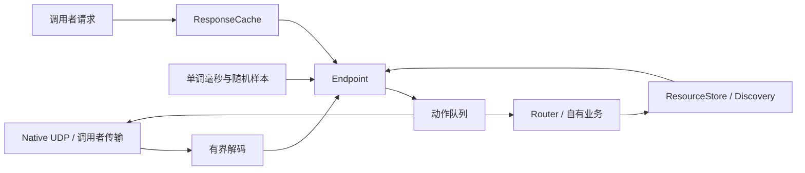

# MoonCoAP 技术设计

首版为单播 CoAP 的有界协议内核。输入为字节、结构化请求、响应、调用者时钟；输出为显式动作。主状态机不调用网络，不读取全局时钟，便于复现损坏、丢包和延迟。

## 身份与状态

ACK/RST 使用 peer+MID 关联，独立响应使用 peer+Token。piggyback ACK 必须同时匹配原请求 MID 和 Token。重复独立 CON 响应使用接收确认记录重放 ACK，不重复通知业务。

客户端状态为 Queued → Sending → WaitingResponse → 完成移除。Empty ACK 释放 NSTART 发送额度，但继续等待独立响应。NON 请求等待响应期间也计入未完成交互额度。客户端请求与服务端独立 CON 回复共用 peer 的 NSTART 和全局 ID 公平调度；超期项不得启动。

时间为 Int64 毫秒，倒退与溢出返回错误。定时器分别限制重传次数、MAX_TRANSMIT_SPAN、MAX_TRANSMIT_WAIT 和整体响应期限。一次 poll 每个交换最多发一次重传，不追赶所有遗漏计时。接收 ACK 只清理过期，不预先发重传。

MID 分配器对 peer+MID 保留生命周期租约，容量满回压，不提前复用；Token 为 8 字节单调计数，初始化由调用者决定。`network_config` 使用 Core 随机源初始化 Native 网络端点。随机源在平台熵不可用时会使用 Core 的回退实现，因此不提供密码学认证保证。

## 服务端执行与去重

业务请求入队前保存原报文及 peer+MID。重发同一报文只回放缓存响应或 Empty ACK；MID 生命周期内携带不同报文返回冲突。同一请求的一次副作用保护仅覆盖这个内存记录和有效生命周期，不是持久化业务事务。

`serve` 在 handler 前验证注册记录、数据、时钟、回答状态与动作预算，设置已执行标志后调用 handler。handler 返回非法响应时，调用者只能手动补正确响应，不能再次进入 handler。直接 `respond` 接口由调用者负责自己的业务执行约束。

容量满时不逐出活 POST 记录。显式 Failed/Capacity 让驱动层决定回压；部分报文错误会产生 RST，即使 API 返回 Err 也要 drain。

## 资源与发现

路由按解码后的字节段数组匹配，`/a%2Fb` 不等于 `/a/b`。根路径的空数组与单个空段规范化为同一根资源。重复和末尾空段仍保留，点段在 URI 解析时消除。

ResourceStore 保存字节表示、Content-Format、Max-Age 与 8 字节版本 ETag。版本增长不因删除重置；写入先验证全部容量与格式再替换。条件失败保持原表示。POST 留给 Router 中的业务 handler。

Link Format 独立解析器有负载、链接数和属性数限制。序列化保留转义，过滤按 rt/if/rel/ct 的单个词值匹配。Discovery 目录限定同源路径，无 anchor；通用解析器能够保留非目录的 URI 引用，但不解析其跨源上下文关系。

## 缓存

CacheKey 包含 peer、按稳定选项排序后的表示选择信息，省略 Token/MID、已理解的 ETag 与 NoCacheKey 选项。整数选项归一化，重复路径/查询保持顺序。显式 peer 应包含安全上下文，否则调用者可能混用不同身份的数据。

只接纳无负载 GET 与 2.05；有界 LRU 可淘汰普通表示，区别于去重记录。陈旧项可保留用于验证；2.03 必须带原有且请求确实提供的 ETag。元数据按选项组替换，合并以及生成 Max-Age/验证请求后再次检查协议容量。

## Native UDP

单个有界 64KiB 接收缓冲防止把截断 UDP 当完整报文。超过 Limits 的实际长度直接丢弃。所有网络调用依赖公开 `moonbitlang/async/socket` API；核心无 FFI 或其他语言协议实现。

step 按最近协议期限限制等待，先处理收到的控制包，再 poll；发送错误变为 Discarded 诊断。事件缓存有上限，调用者必须及时 drain。exchange 超时清理本请求取消记录，避免污染后续交换；其他业务事件保留给调用者，双向场景应使用 request/step。

默认 UDP 时钟由公开 async.now 相对化并夹持不下降；系统回拨会延长计时。这是已说明的限制，严格单调时钟适配属于后续维护议题。

## API 与依赖边界

报文与配置采用公开值类型；Endpoint、Allocator、Router、ResourceStore、Discovery、ResponseCache、UdpEndpoint 的内部队列和租约均为私有。公开状态快照不暴露内部可变数组。核心依赖 MoonBit Core；UDP 的 async 依赖版本为 0.22.4。
